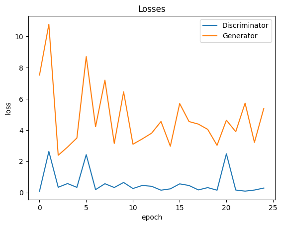
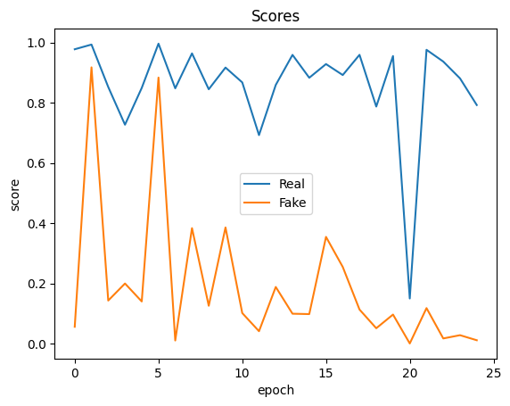
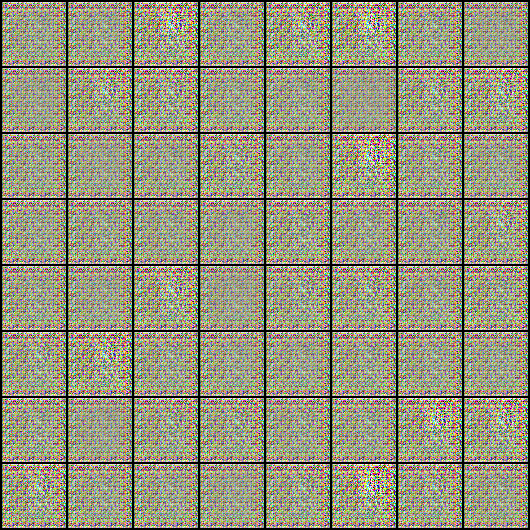
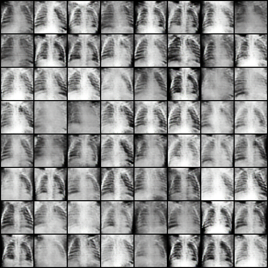
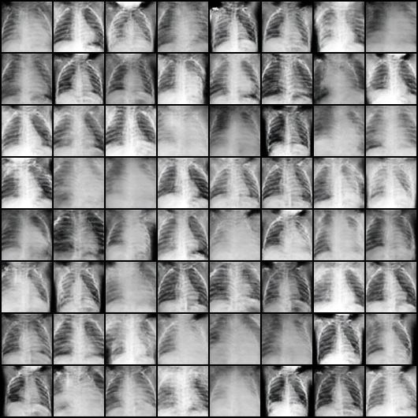

# Generative Adversarial Networks for Synthetic Lung Cancer X-ray Images

**Shreya Mali**  
IIT Gandhinagar  
November 2025

## Overview
Medical imaging datasets are often limited due to privacy constraints, high annotation costs, and limited patient availability. This project explores the use of **Generative Adversarial Networks (GANs)** to generate **synthetic lung cancer X-ray images** for data augmentation and improved downstream model performance.

A **DCGAN-based architecture** is implemented **from scratch in PyTorch** and trained on the *Lung Cancer X-Ray* dataset from Kaggle. The generated images are evaluated using loss curves, discriminator behavior, and visual inspection.

---

## Key Objectives
- Address data scarcity in medical imaging
- Implement and train a DCGAN from scratch
- Generate realistic synthetic lung cancer X-ray images
- Analyze GAN training stability and convergence behavior

---

## Dataset
**Source:** Lung Cancer X-Ray Dataset (Kaggle)

| Parameter | Value |
|--------|------|
| Classes | Cancer, Non-Cancer *(only Cancer class used)* |
| Image Size | 64 × 64 (resized) |
| Data Split | 100% training (GAN training) |

---

## Data Preprocessing
The following preprocessing steps were applied:
- Resized images to **64 × 64**
- Normalized using **mean = 0.5**, **std = 0.5**
- Converted images to tensors
- Removed duplicate images using **MD5 hashing**

This ensured clean and non-redundant training data.

---

## Model Architecture

### Discriminator
A CNN that predicts whether an image is real or fake.

**Input:** `3 × 64 × 64`

**Layers:**
- Conv2D (64, 4×4, stride 2) + BatchNorm + LeakyReLU  
- Conv2D (128, 4×4, stride 2) + BatchNorm + LeakyReLU  
- Conv2D (256, 4×4, stride 2) + BatchNorm + LeakyReLU  
- Conv2D (512, 4×4, stride 2) + BatchNorm + LeakyReLU  
- Conv2D (1, 4×4) + Sigmoid  

---

### Generator
Generates synthetic X-ray images from random noise.

**Input:** `128 × 1 × 1` (latent vector)

**Layers:**
- ConvTranspose2D (512, 4×4, stride 1) + BatchNorm + ReLU  
- ConvTranspose2D (256, 4×4, stride 2) + BatchNorm + ReLU  
- ConvTranspose2D (128, 4×4, stride 2) + BatchNorm + ReLU  
- ConvTranspose2D (64, 4×4, stride 2) + BatchNorm + ReLU  
- ConvTranspose2D (3, 4×4, stride 2) + Tanh  

---

##Training Methodology

### Hyperparameters

| Parameter | Value |
|--------|------|
| Epochs | 25 |
| Batch Size | 128 |
| Learning Rate | 0.0002 |
| Optimizer | Adam (β₁=0.5, β₂=0.999) |
| Latent Dimension | 128 |

### Training Strategy
1. **Discriminator Update**
   - Real images → label = 1  
   - Fake images → label = 0  

2. **Generator Update**
   - Generator tries to fool discriminator  
   - Fake images labeled as real (1)

---

## Results

### Loss Curves
- Initial sharp drop in generator loss indicates rapid learning
- Oscillating losses during mid-training reflect healthy adversarial competition
- Stabilization toward later epochs suggests convergence rather than mode collapse

  

  

### Sample Generated Images

- Image quality improves steadily across epochs
  
  

- Structural features resemble chest X-rays

  
  
- Minor artifacts remain, typical in GAN training

  

---

## Observations
- Image realism improves with training
- Some artifacts persist
- Training instability observed due to adversarial dynamics

---

## Discussion
The GAN successfully generates synthetic lung X-ray images resembling real data. Performance can be further improved through:
- Advanced architectures (WGAN, StyleGAN)
- Larger and more diverse datasets
- Stabilization techniques (gradient penalty, spectral normalization)
- Quantitative evaluation metrics (FID score)

---

## Conclusion
This project demonstrates the feasibility of using GANs to generate synthetic lung cancer X-ray images for data augmentation. Such approaches show promise in medical imaging domains where data scarcity limits deep learning performance.

---

## References
- S. Islam et al., *GANs in Medical Imaging*, IEEE Access, 2024  
- I. Goodfellow et al., *Generative Adversarial Networks*, NeurIPS 2014  
- A. Radford et al., *DCGAN*, arXiv:1511.06434  
- M. Arjovsky et al., *Wasserstein GAN*, arXiv:1701.07875  

---

## Repository Contents
- `gan_lung_xray.ipynb` – Training and evaluation notebook  
- `models/` – Generator and Discriminator definitions  
- `results/` – Generated images and loss plots  
- `README.md` – Project documentation
